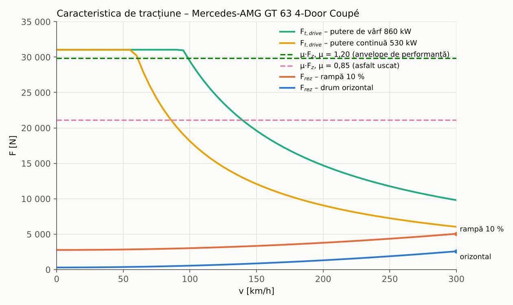
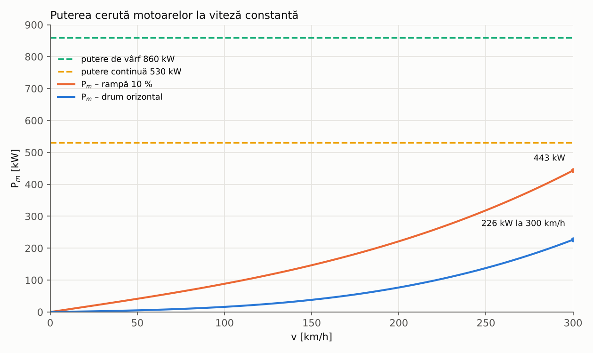
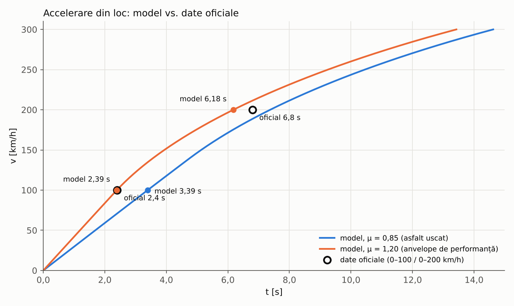

# Etapa 1 de calcul – dinamica longitudinală a vehiculului

**Vehicul:** Mercedes-AMG GT 63 4MATIC+ 4-Door Coupé (versiunea de serie a Concept AMG GT XX)
**Metodă:** relațiile (1)–(50) din „Noțiuni generale de dinamica vehiculului” (curs CCA C1, L. Popescu, UPB)

| Fișier | Conținut |
|---|---|
| [`CCA_Calcul1_Dinamica_GT63.xlsx`](CCA_Calcul1_Dinamica_GT63.xlsx) | Calculul complet, cu formule: **Rezultate** (sinteza pentru predare), **Date de intrare**, **Calcul regimuri** (relație cu relație), **Caracteristica tractiune** (F(v), P(v), timpi de accelerare + grafice) |
| [`calcul_dinamica_GT63.m`](calcul_dinamica_GT63.m) | Același calcul în MATLAB (rulează și în GNU Octave) – afișează tabelul regimurilor și desenează graficele |
| `fig_forte_tractiune.png`, `fig_puteri.png`, `fig_accelerare.png` | Graficele pentru raport |
| `build_calcul.py`, `grafice_calcul1.py` | Regenerează fișierul Excel și graficele |

Valorile din Excel și din scriptul MATLAB au fost comparate: coincid pentru toate regimurile.

## 1. Date de intrare

| Mărime | Valoare | Tip |
|---|---|---|
| Masa de calcul M (masa UE în ordine de mers = 2460 kg DIN + 75 kg șofer) | 2535 kg | oficial |
| Cx / aria frontală S | 0,22 / 2,44 m² | oficial |
| Cuplul maxim al sistemului / puterea de vârf / puterea continuă | 2000 N·m / 860 kW / 530 kW | oficial |
| v_max / 0–100 km/h / 0–200 km/h | 300 km/h / 2,4 s / 6,8 s | oficial |
| Raza dinamică r_w (anvelopă 295/30 R21, k = 0,97) | 0,345 m | ipoteză |
| Raportul de transmitere i_g (din „peste 13 000 rot/min” la 300 km/h) | 5,63 | estimat |
| Randamentul transmisiei η / coeficientul maselor în rotație δ | 0,95 / 1,0 | ipoteză / curs (rel. 23) |
| ρ / f / μ | 1,225 kg/m³ / 0,012 / 0,85 | atmosferă standard / tabelele cursului (asfalt uscat) |

Sursele datelor oficiale: [comunicatul de lansare Mercedes-Benz Media, 20.05.2026](https://media.mercedes-benz.com/en/article/c8b7109f-2287-4070-b776-9204da1513ef)
și [articolul despre motorul cu flux axial](https://media.mercedes-benz.com/en/article/bebac2af-acdc-465a-9538-adb0bf3d8ccf).
Dimensiunile anvelopelor și rapoartele de transmitere nu sunt publicate pentru versiunea electrică – de aceea sunt ipoteze.

## 2. Regimuri caracteristice

F_t = ½·ρ·Cx·S·v² + f·M·g·cos α + M·g·sin α + δ·M·a (rel. 26), T_w = F_t·r_w (31), P_w = F_t·v (28),
P_m = P_w/η (29), T_m = F_t·r_w/(i_g·η) (33), verificare F_t ≤ min(F_t,drive ; μ·F_z) (42)–(43).

| Regim | v [km/h] | Pantă | a [m/s²] | F_t [N] | T_w [N·m] | P_m [kW] | T_m [N·m] | n_m [rot/min] | μ necesar | Condiția (43) |
|---|---|---|---|---|---|---|---|---|---|---|
| S1 – viteză maximă, drum orizontal | 300 | 0 | 0 | 2 582 | 890 | 226,5 | 166 | 13 000 | 0,10 | îndeplinită |
| S2a – accelerare 0–100 în 2,4 s, la pornire | 0 | 0 | 11,57 | 29 639 | 10 212 | 0 | 1 910 | 0 | 1,19 | **neîndeplinită (aderență)** |
| S2b – accelerare 0–100 în 2,4 s, la 100 km/h | 100 | 0 | 11,57 | 29 892 | 10 299 | 874,0 | 1 926 | 4 333 | 1,20 | **neîndeplinită (aderență)** |
| S3 – rampă 10 % la 100 km/h | 100 | 10 % | 0 | 3 025 | 1 042 | 88,5 | 195 | 4 333 | 0,12 | îndeplinită |
| S4 – pornire pe pantă de 30 % | 0 | 30 % | 0 | 7 432 | 2 561 | 0 | 479 | 0 | 0,31 | îndeplinită |

## 3. Indicatori de performanță

| Indicator | Calculat | Oficial |
|---|---|---|
| Timp 0–100 km/h cu μ = 0,85 (asfalt uscat, tabelul cursului) | 3,39 s | 2,4 s |
| Timp 0–100 km/h cu μ = 1,20 (anvelope de performanță) | 2,39 s | 2,4 s |
| Timp 0–200 km/h cu μ = 1,20 | 6,18 s | 6,8 s |
| Coeficient de aderență necesar pentru 0–100 km/h în 2,4 s | 1,19 | – |
| Viteza maximă teoretică limitată de puterea continuă / de vârf | 406 / 480 km/h | 300 km/h (limitată electronic) |
| Panta maximă limitată de aderență (μ = 0,85) | 83,8 % | – |

## 4. Concluzii

1. **Viteza maximă nu este limitată de putere.** La 300 km/h sunt necesari 2582 N la roți și 226 kW la motoare (43 % din
   puterea continuă); 88 % din rezistență este aerodinamică. Limita de 300 km/h este electronică și de turație
   (13 000 rot/min la motoarele spate); cu puterea continuă, viteza teoretică ar fi ≈ 406 km/h.
2. **Accelerarea este limitată de aderență, nu de acționare.** Pentru 0–100 km/h în 2,4 s este nevoie de μ ≥ 1,19.
   Cu μ = 0,85 (asfalt uscat, tabelul cursului) se pot transmite doar 21 138 N din cei 31 039 N pe care îi poate
   furniza acționarea, iar timpul minim estimat este 3,4 s.
3. **Modelul reproduce performanța oficială** cu anvelope de performanță (μ = 1,20): 2,39 s la 0–100 km/h (oficial 2,4 s)
   și 6,18 s la 0–200 km/h (oficial 6,8 s; abaterea de 9 % provine din neglijarea maselor în rotație, δ = 1, și a
   pierderilor din invertor și baterie). Ipotezele pentru r_w, i_g și η sunt deci plauzibile.
4. **Puterea de vârf (860 kW) este necesară doar pentru performanța maximă:** menținerea accelerației medii de 11,57 m/s²
   până la 100 km/h ar cere 874 kW, adică 102 % din puterea de vârf.
5. **Rampele nu sunt o problemă:** 10 % la 100 km/h cere 88 kW, iar pornirea pe 30 % cere 7432 N (μ necesar 0,31).
6. **De confirmat în etapele următoare:** dimensiunea anvelopelor, rapoartele reale față/spate, distribuția cuplului
   între punți și cuplul continuu al motoarelor. Pasul următor din curs: modelul dinamic și curbele T(n), P(n) ale motorului.
